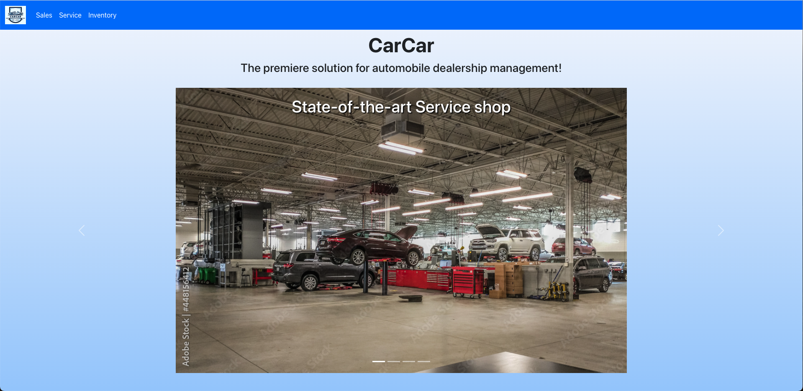
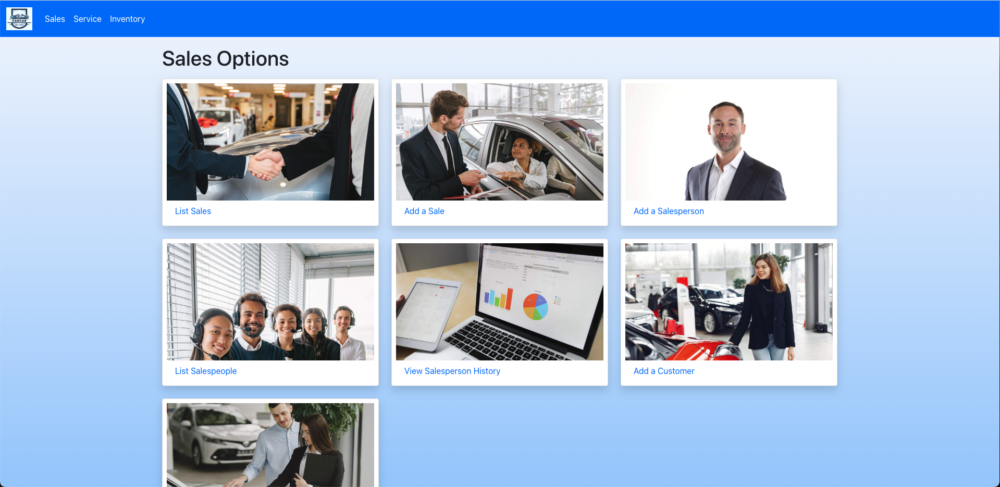
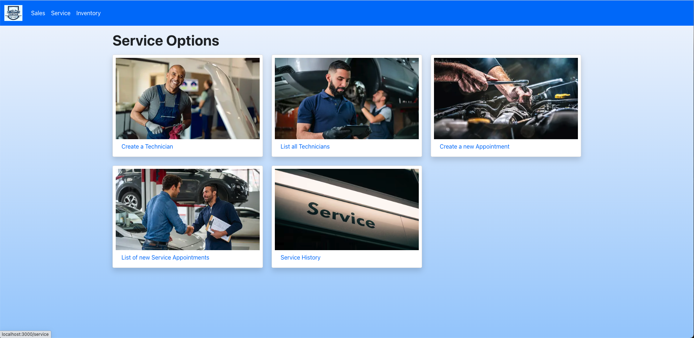
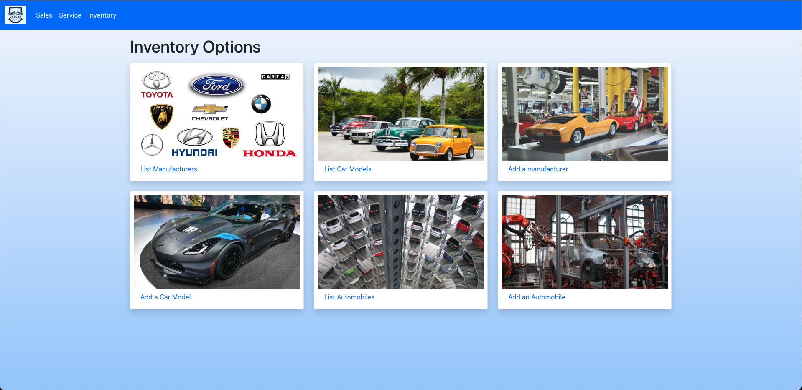

# CarCar


---

### Team:

* Anthony Spence - Service microservice
* Dennie Chan - Sales microservice

### Trello Kanban Planning Board:
[Project Beta Trello Board](https://trello.com/b/LAx76yAu/project-beta)

## Steps to Run Project
```
1. Fork the project located at  https://gitlab.com/DennieCodes/project-beta

1. Once the project is forked, clone via git clone https link.

1. Once cloned, CD into project directory and run the following commands:

1. docker volume create beta-data

1. docker-compose build

1. docker-compose up

When you run docker-compose up and if you're on macOS, you will see a
warning about an environment variable named OS being missing. You can safely ignore this.*

visit http://localhost:3000/ in your browser to view the React application
once all containers are up and running

In order to work with data you can create it in insomnia.
```


# Summary

CarCar is a Mock Car Dealership App that branches off into three different microservices. There is the Sales department that deals with the Salespeople, the customer, and the cars themselves. They also use a value object from the Inventory. There is the Service department that deals with the Technicians, the customer, and also use a value object from Inventory. The last is the Inventory that deals with the cars themselves. Each of these have their own database and poll every 60 seconds to check for updates. This app uses Django in the backend with a React front. It also utilizes the Docker container system to run on.

**Inventory Options:**  List Manufacturers, List Car Models, Add a manufacturer, Add a Car Model, List Automobiles, Add an Automobile

**Sales Options:** List Sales, Add a Sale, Add a Salesperson, List Salespeople, View Salespeople History, Add a Customer, List Customers

**Service Options:** CREATE A NEW TECHNICIAN,LIST ALL TECHNICIANS, CREATE A NEW APPOINTMENT, LIST OF NEW SERVICEAPPOINTMENTS,SERVICE HISTORY


# CRUD


 ## React Front End for Sales
 
---
 ```
http://localhost:3000/sales/ - Lists out all sales records

http://localhost:3000/salesform - Form to create a new sales record

http://localhost:3000/salespeople - List all salespeople

http://localhost:3000/salesperson - Add a salesperson to salespeople list

http://localhost:3000/saleshistory - View each salesperson's sales history

http://localhost:3000/customer - List all customers

http://localhost:3000/customer - Add to list of customers
```


## React Front End for Service

---

```
http://localhost:3000/addTechnician - Form to create a new Auto technician

http://localhost:3000/listTechnicians - List all service technicians

http://localhost:3000/CreateAppointments - Form to create a new appointment

http://localhost:3000/ListServiceAppointments - List all service appointments

http://localhost:3000/ServiceHistory - List Service History
```

## React Front End for Inventory

---

```
http://localhost:3000/manufacturers - List all manufacturers

http://localhost:3000/addmanufacturers - Add to manufacturers list

http://localhost:3000/carmodels - List all Car Models

http://localhost:3000/addmodel - Add to list of Car Models

http://localhost:3000/automobiles - List all automobiles

http://localhost:3000/addautomobiles - Add to list of automobiles
```


# Api's/Method/Port/Result/URLs


# Models Diagram


## Poller
Automobiles from inventory are polled every 60 seconds which creates an AutmobileVO (valueobject) for the Sales and Service microservices.

# Service microservice

```
Technician Model:
- "first_name",
- "last_name",
- "employee_id" inputs are received through form.

Appointment Model:
- "vin", Vehicle vin.
- "customer_name", vehicle ownwer name.
- "date_and_time", scheduled service appointment date and time; inputs received thorugh form
- "reason", reason for service appointment.
- "dealership_purchase", determines whether the vehicle vin for the service appointment matches inventory vehicle for access to VIP treatment.
- "technician", the selected technician for the service appointment. Technician was a Foreign Key with Appointment as the related word.

AutomobileVO Model:
-"sold", a boolean that would answer whether the car had been sold
- "vin", of the vehicle in inventory.

Relation of Inventory microservice:
-The Service microservice relied on the Inventory polling and we made a AutomobileVO that reflected all the inventories vin numbers so that: 1. We could determine whether they were VIP, 2. The search bar in the Service History form also needed the Inventory.
```

# Sales microservice
```
Salesperson Model
    -"first_name",
    -"last_name",
    -"employee_id"

Customer Model:
    -"first_name",
    -"last_name",
    -"address",
    -"phone_number"

Sale Model:
    -"price",
    -"automobile" (Foreign key),
    -"customer" (ForeignKey),
    -"salesperson" (ForeignKey)

Relation to Inventory:
    - The sales microservice polled the automobile model in inventory to reference automobiles which sales utilized to coordinate which cars were sold, by which salesperson, and also to which customer.
```


## Project Architecture Diagram

